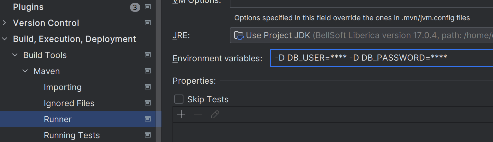

## Client-service.

Веб-сервис для работы с учетными записями клиентов со следующей функциональностью:

1. Создание учетной записи
2. Чтение учетной записи по id
3. Поиск учетной записи по полям [фамилия, имя, отчество, телефон, емейл]. Поиск осуществляется только при условии
   указания хотябы 1 поля.

Клиент может быть создан из разных приложений. В зависимости от приложения отличается логика валидации полей при
создании учетной записи. Приложение определяется по обязательному для указания http-заголовку "x-Source".
Список значений http-заголовка и правила валидации полей:

* **mail** - только имя и емейл обязательные.
* **mobile** - только номер телефона обязательный.
* **bank** - bank_id, фамилия, имя, отчество, дата рождения, номер паспорта обязательные.
* **gosuslugi** - все поля кроме емейла и адреса проживания обязательные.  
  При добавлении нового источника (приложения) требуется реализовать для него логику валидации через имплементацию
  интерфейса [RequestValidator](src/main/java/com/akhazov/clientservice/service/validation/request/RequestValidator.java) ([пример реализации для
  **mobile
  **](src/main/java/com/akhazov/clientservice/service/validation/request/create/client/MobileCreateClientRequestValidator.java)).

* Стек:
    * Java 17
    * Spring Boot 3.1
    * Spring Data JPA
    * Maven
    * PostgreSQL

### Git.

Настройки git, если разработка ведётся на разных операционных системах:

git config --system core.longpaths true - (ДЛЯ WINDOWS) по дефолту для git на Windows выставлен лимит на количество
символов в filename, в результате чего можно получить "Filename is too long".  
git config --global core.eol lf - данная конфигурация позволяет конвертировать переносы строк при добавлении файла в
индекс CRLF → LF и наоборот при извлечении кода.  
git config core.autocrlf false - отключает автоматическое преобразование переносов в CRLF.

### Запуск приложения и отладка.

* Swagger UI: http://localhost:8080/swagger-ui/index.html
* Скрипты [liquibase](src/main/resources/db/changelog)
* Сборка: `./mvnw clean install`
* Локальный запуск.
    * Поумолчанию приложение локально запускается под default профилем, с развертыванием окружения с
      помощью [docker compose](compose.yaml).
    * Для корректной работы нужно заполнить username/password подключения к субд в
      файле [application.yml](src/main/resources/application.yml).
      Либо указав параметры запуска: `-D DB_USER= -D DB_PASSWORD=`. В IDEA достаточно прописать эти
      параметры `Settings -> Build, Execution, Deployment -> Build Tool -> Maven -> Runner -> Environment variables:`

* 